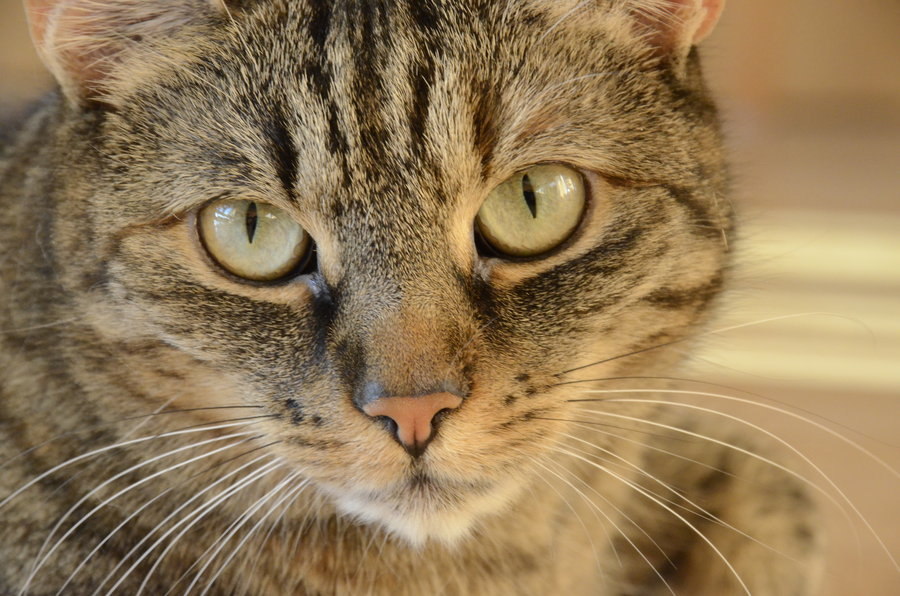
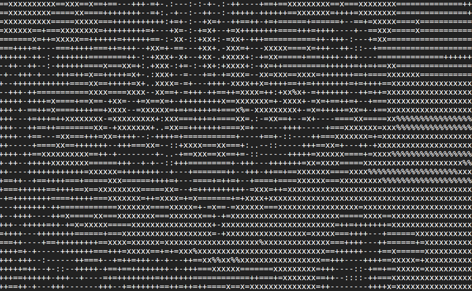

# txtpic
> Generate Unicode art from images

## Installation
You'll need [Cargo](http://doc.crates.io) to install `txtpic`.

    $ cargo install txtpic

## Usage

    txtpic 1.2.0
    Jeremy Dormitzer <jeremy.dormitzer@gmail.com>
    Generates text representations of images

    USAGE:
    txtpic [FLAGS] [OPTIONS] <IMAGE>

    FLAGS:
    -h, --help       Prints help information
    -i, --invert     Invert the result to make it suitable for black text on a white background
    -V, --version    Prints version information

    OPTIONS:
    -c, --character-set <CHARACTERS>    An alternate character set to use
    -p, --preset <PRESET NAME>          A preset character set to use [default: small]  [values: small,
    medium, large]
    -w, --width <WIDTH>                 An approximate width value for the result [default: 80]

    ARGS:
    <IMAGE>    The input image

## Example
Here is an adorable cat.

Converting it with:

    $ txtpic --width 100 cat.jpg

Gives the [output](./example/cat.txt):

